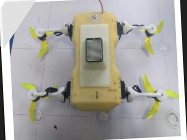
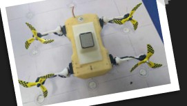
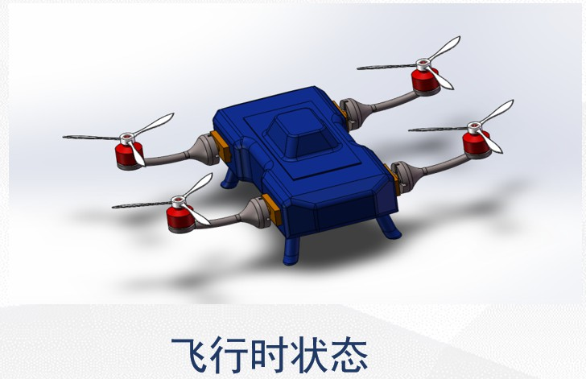
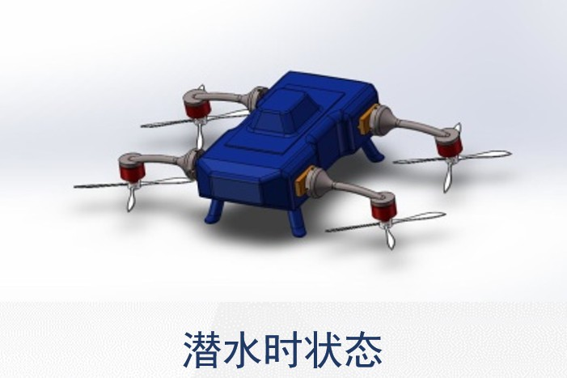
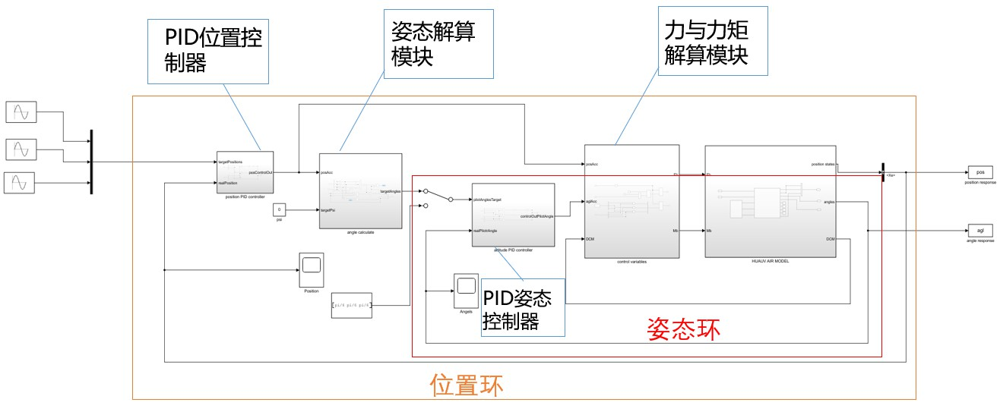
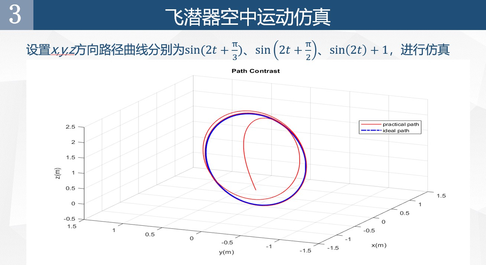
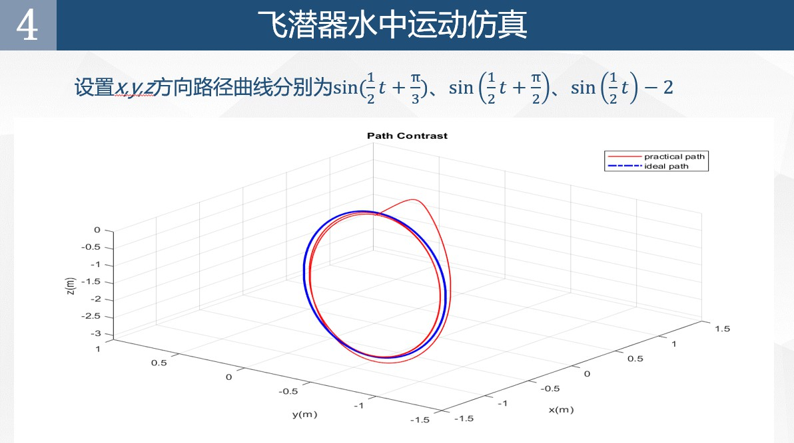
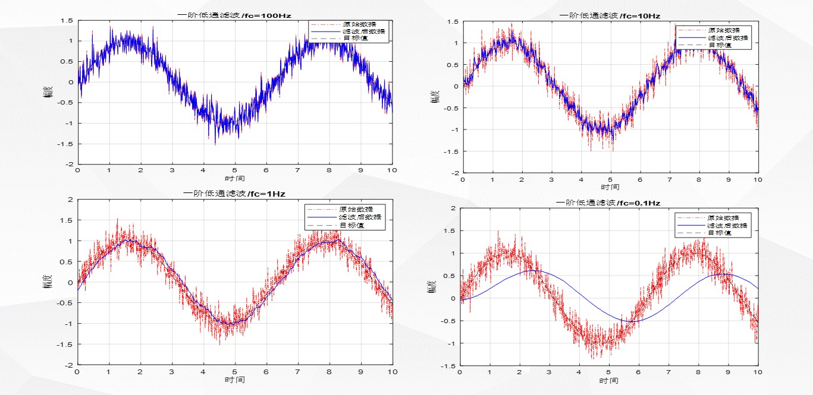
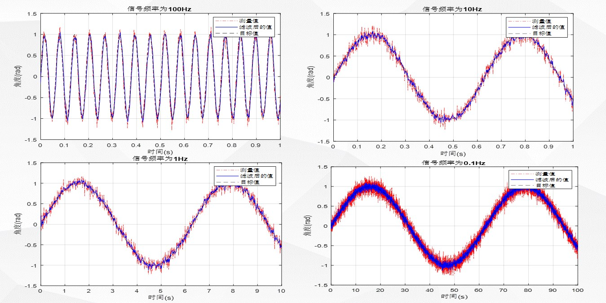

# Unmanned-Aerial-Underwater-Vehicle
This is my undergraduate graduation design about a new UAUV design. 
<<<<<<< HEAD

- 该项目为本科二年级时的一个大创项目，当时做了一个实物模型，能够飞行，潜水没有试过，但是水密性良好；
- 做毕业设计时由于实物模型已经损坏，所以做了改模型的仿真分析；
- 该模型分为空中和水中两个模型，控制模型为四旋翼飞行器模型，水中模型参考《Hybrid Unmanned Aerial Underwater Vehicle Modeling and Simulation》论文中的模型；
- 控制方法使用的是串级PID控制器，空中模型和水中模型各使用一套控制器。此外，还研究了两种常用的滤波方法：一阶低通滤波和卡尔曼滤波；
- 由于自己能力有限，空中和水中模型之间切换时没有做任何处理只是直接将模型切换。

## 图片
1. 实物图

2. 模型图

3. 仿真模型

4. 仿真结果

